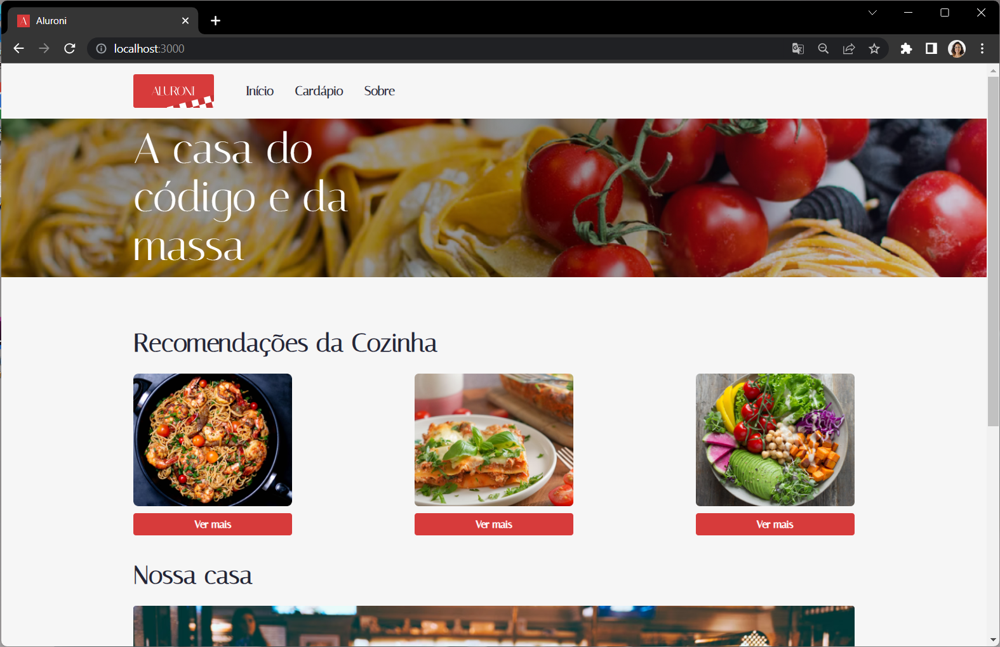

# Aluroni

## Conteúdo

- [Visão geral](#visão-geral)
  - [O projeto](#o-projeto)
  - [Screenshot](#screenshot)
  - [Links](#links)
- [Meu processo](#meu-processo)
  - [Tecnologias usadas](#tecnologias-usadas)
  - [O que aprendi](#o-que-aprendi)
- [Créditos](#créditos)
   - [Repositorio Original](#repositório-original)

> Programa Desenvolve e Alura  
O programa desenvolve é um programa gratuito de formação e inclusão de talentos em tecnologia do Grupo Boticário. Em parceria com o Alura Include, as aulas são realizadas online pela plataforma. O curso tem duração de 6 meses e estou participando da trilha de formação Full Stack.

## Visão Geral
### O Projeto
Esse projeto realizado junto ao programa Desenvolve 2023 teve como objetivo criar uma página de um restaurante com a tecnologia React. O projeto foi realizado em duas partes, a princípio montando a parte do cardápio e suas funcionalidade, enquanto no segundo curso aprendi sobre react routes fazendo a página 'início' e 'sobre'.

### Screenshot

### Links
- [Visite o projeto online](https://aluroni-santosfer.vercel.app/)

## Meu Processo

### Tecnologias Usadas
- React
- Typescript

### O que aprendi
Nesse curso foi possível aprender criar uma landing page com react do zero. Aprendi a baixar a inicialização do react app, com template typescript e após isso montar essa página do zero. Foi possível aprender sobre como funciona o `scss` e a aplicação de `classNames` dele, através do modules. Montei os componentes e os tornei utéis através das funções e pude entender um pouco mais como funciona o props. Também nesse curso foi explicado como utilizarmos imagens através da pasta `public`, para que não desse problema na hora da aplicação realizar o build e não encontrar o arquivo.

No segundo curso realizei a criação das outras duas páginas, montando o nav bar e construindo as páginas `Início` e `Sobre`. Entendi como criar e separar os componentes `menu`, `header` e `footer` para que eles pudessem ser reutilizados entre todas as páginas, sem a necessidade de renderizar novamente. Também utilizei algumas funcionalidades do react-router-dom para que a mudança entre páginas fosse mais dinâmica e também criando um código mais limpo e de fácil compreensão de acordo com o aprendizado do projeto.

## Créditos

### Repositório original
- [Repositório da aula](https://github.com/alura-cursos/aluroni-introducao/tree/Aula5)
